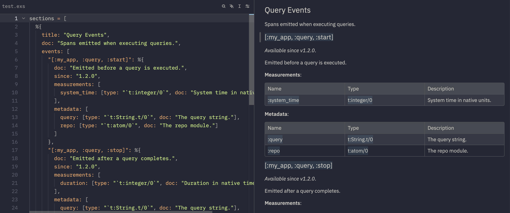

# TelemetryDocs

> Programmatically list and document your telemetry events.

This is a dev-only library that lets you define your events as structured data, and render them into a Markdown page suitable for use as an [ExDoc extra](https://hexdocs.pm/ex_doc/Mix.Tasks.Docs.html#module-configuration).

## Why

It's hard to document telemetry events in a way that is consistent and easy to work with. This library lets you solve the consistency problem:



The library is not meant to be a one-size-fits-all solution, but rather a starting point for you to build on and customize as needed. It only exposes a function to convert this structured data into Markdown. It's up to you to expose that in a Mix task, build script, or something else.

## Installation

Add `telemetry_docs` to your list of dependencies in `mix.exs`, in whatever Mix environment you're using ExDoc in:

```elixir
def deps do
  [
    {:telemetry_docs, "~> 0.1.0", only: :dev}
  ]
end
```

You do not need `:telemetry_docs` in your production builds unless that's where you build documentation.

### Agents

If you want an agent (like Claude Code or Codex) to extract existing telemetry events from your codebase and turn them into `TelemetryDocs` documentation, ask your agent to read and follow [`deps/telemetry_docs/llm_usage.md`](./llm_usage.md).

## Integration with ExDoc

A quick and easy way to integrate this into your documentation flow is to replace the `docs` Mix task provided by ex_doc with an alias. In your `mix.exs`:

```elixir
def project do
  [
    # ...
    aliases: [
      docs: [&telemetry_docs/1, "docs"]
    ]
  ]
end

defp telemetry_docs(_args) do
  {events, _bindings} = Code.eval_file("pages/telemetry_events.exs")
  content = TelemetryDocs.to_markdown(events)
  File.write!("pages/telemetry-events.md", content)
end
```
